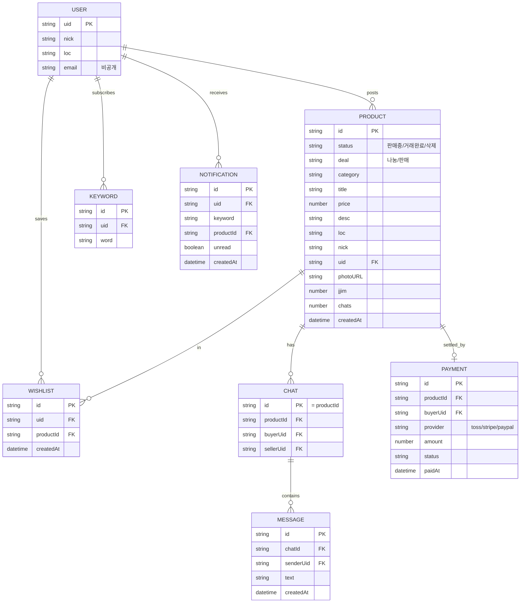

# 04. ERD — 오이(52)지마켓

> 논리 데이터 모델 + 물리 매핑(구글시트 / Firestore / Storage).
> 매물은 시트, 실시간·개인 데이터는 Firestore.

---

## 1. 논리 ERD



---

## 2. 물리 매핑 개요
| 엔티티 | 저장소 | 이유 |
|---|---|---|
| PRODUCT | **Google Sheets `매물`** | 운영자 직접 편집/삭제 |
| USER(프로필) | Firebase Auth + Firestore `users/{uid}` | 인증·닉네임·근무지 |
| WISHLIST | Firestore `users/{uid}/wishlist` | 개인·실시간 |
| KEYWORD | Firestore `users/{uid}/keywords` | 개인 |
| NOTIFICATION | Firestore `users/{uid}/notifications` | 개인·실시간 |
| CHAT/MESSAGE | Firestore `chats/{productId}/messages` | 실시간 |
| PAYMENT | Firestore `payments/{id}` (+ 시트 미러 선택) | 거래 기록 |
| 이미지 | Firebase Storage `listings/{uid}/{ts}.webp` | 바이너리 |

---

## 3. 구글시트 `매물` 스키마 (단일 출처)
| # | 컬럼 | 타입 | 설명 |
|---|---|---|---|
| A | `id` | string | 고유 ID (자동) |
| B | `createdAt` | datetime | 등록 시각 (자동) |
| C | `status` | enum | 판매중 / 거래완료 / 삭제 |
| D | `deal` | enum | 나눔 / 판매 |
| E | `category` | enum | 전산소모품 / 사무용품 / 가구·비품 / 기타 |
| F | `title` | string | 제목 |
| G | `price` | number | 단가(원), 나눔=0 |
| H | `desc` | string | 설명 |
| I | `loc` | string | 근무지(픽업 위치) |
| J | `nick` | string | 닉네임 |
| K | `uid` | string | 작성자 Firebase UID |
| L | `photoURL` | url | Storage 다운로드 URL |
| M | `jjim` | number | 찜 수(집계) |
| N | `chats` | number | 대화 수(집계) |

규칙: `status=삭제` 또는 행 삭제 시 목록 제외. `jjim/chats`는 집계 캐시(증감만).

---

## 4. Firestore 컬렉션 설계
```
users/{uid}
  { nick, loc, createdAt, fcmToken? }
  wishlist/{productId}      { productId, createdAt }
  keywords/{kwId}          { word, createdAt }
  notifications/{notiId}   { keyword, productId, title, loc, unread, createdAt }

chats/{productId}
  { productId, buyerUid, sellerUid, lastMessage, updatedAt }
  messages/{msgId}         { senderUid, senderNick, text, createdAt }

payments/{paymentId}
  { productId, buyerUid, provider, amount, status, paidAt }
```

---

## 5. 보안 규칙 (요지)

### Firestore
```
match /users/{uid}/{doc=**} {
  allow read, write: if request.auth.uid == uid;
}
match /chats/{cid} {
  allow read, write: if request.auth != null
    && request.auth.uid in [resource.data.buyerUid, resource.data.sellerUid];
  match /messages/{mid} {
    allow read, create: if request.auth != null;
  }
}
match /payments/{pid} {
  allow read: if request.auth.uid == resource.data.buyerUid;
  allow create: if request.auth != null;
}
```

### Storage
```
match /listings/{uid}/{file} {
  allow read: if true;
  allow write: if request.auth != null && request.auth.uid == uid;
}
```

---

## 6. 인덱스/집계 메모
- 매물 정렬은 시트에서 `createdAt` 내림차순(Apps Script가 정렬해 반환).
- 찜 수: 찜 토글 시 `updateProduct(id,{jjim:+/-1})` 로 시트 캐시 갱신(레이스 허용, 최종일관성).
- 알림: Phase 1은 클라이언트 매칭, Phase 3은 서버(트리거+FCM).
