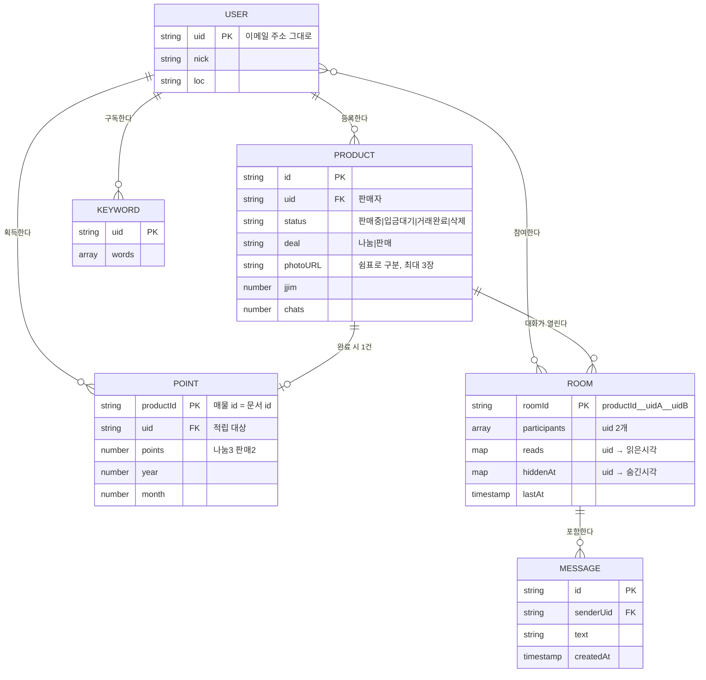

# ERD — 오이(52)지마켓

> **데이터 모델 정의서 (Entity Relationship Diagram)**
> 최종 갱신: 2026-09-02 · Firestore 프로젝트: `g-market-94b03`

---

## 1. 관계도


```mermaid
erDiagram
    USER ||--o{ PRODUCT : "등록한다"
    USER ||--o{ POINT : "획득한다"
    USER ||--o{ KEYWORD : "구독한다"
    USER }o--o{ ROOM : "참여한다"
    PRODUCT ||--o{ ROOM : "대화가 열린다"
    PRODUCT ||--o| POINT : "완료 시 1건"
    ROOM ||--o{ MESSAGE : "포함한다"

    USER {
        string uid PK "이메일 주소 그대로"
        string nick
        string loc
    }
    PRODUCT {
        string id PK
        string uid FK "판매자"
        string status "판매중|입금대기|거래완료|삭제"
        string deal "나눔|판매"
        string photoURL "쉼표로 구분, 최대 3장"
        number jjim
        number chats
    }
    ROOM {
        string roomId PK "productId__uidA__uidB"
        array participants "uid 2개"
        map reads "uid → 읽은시각"
        map hiddenAt "uid → 숨긴시각"
        timestamp lastAt
    }
    MESSAGE {
        string id PK
        string senderUid FK
        string text
        timestamp createdAt
    }
    POINT {
        string productId PK "매물 id = 문서 id"
        string uid FK "적립 대상"
        number points "나눔3 판매2"
        number year
        number month
    }
    KEYWORD {
        string uid PK
        array words
    }
```

> **USER 는 별도 컬렉션이 아니다.** 사용자 정보는 Firebase Auth 의 uid(=이메일)와
> 각 문서에 비정규화된 `nick` 으로 표현된다. 프로필은 브라우저 로컬에 보관한다.

---

## 2. Firestore 컬렉션 (주 저장소)

### 2.1 `products/{productId}`

| 필드 | 타입 | 설명 |
|---|---|---|
| `id` | string | 문서 id 와 동일 |
| `uid` | string | 판매자 uid (이메일) |
| `nick` | string | 판매자 닉네임 (비정규화) |
| `title` | string | 제목 |
| `desc` | string | 설명 |
| `deal` | string | `나눔` \| `판매` |
| `price` | number | 나눔이면 0 |
| `category` | string | `전산소모품` \| `사무용품` \| `가구·비품` \| `기타` |
| `loc` | string | 사무실 위치 (13곳 중 택1) |
| `photoURL` | string | **쉼표로 이어붙인 Drive URL, 최대 3개** |
| `status` | string | `판매중` \| `입금대기` \| `거래완료` \| `삭제` |
| `jjim` | number | 찜 수 |
| `chats` | number | 대화 수 |
| `createdAt` | timestamp | 등록 시각 |

**설계 노트**
- **사진을 배열이 아닌 쉼표 문자열로 둔 이유:** 기존 시트 컬럼이 1장짜리 문자열이었다.
  쉼표 구분으로 확장하면 **기존 데이터가 그대로 동작**하고 마이그레이션이 불필요하다.
  Drive URL 에는 쉼표가 없어 구분자로 안전하다.
- **`status='삭제'` 로만 지우는 이유:** 실제 삭제하면 그 매물로 쌓은 포인트의 검증
  근거(`products/{id}.uid`)가 사라져 규칙이 통과되지 않는다. 또 대화 이력도 끊긴다.
- `jjim` / `chats` 는 남이 증가시켜야 하므로 보안 규칙에서 예외로 허용한다.

### 2.2 `rooms/{roomId}`

```
roomId = `${productId}__${[uidA, uidB].sort().join("__")}`
```

| 필드 | 타입 | 설명 |
|---|---|---|
| `roomId` | string | 문서 id 와 동일 |
| `productId` | string | 대상 매물 |
| `productTitle` | string | 매물 제목 (비정규화 — 매물이 지워져도 표시) |
| `participants` | array\<string\> | uid 2개. **쿼리 대상** (`array-contains`) |
| `lastMsg` | string | 마지막 메시지 미리보기 |
| `lastSenderUid` | string | 마지막 발신자 (알림 대상 판정) |
| `lastSenderNick` | string | 마지막 발신자 닉네임 |
| `lastAt` | timestamp | 마지막 메시지 시각. **정렬·안읽음 기준** |
| `reads` | map\<uid, timestamp\> | 각자 마지막으로 읽은 시각 |
| `hiddenAt` | map\<uid, timestamp\> | 각자 목록에서 숨긴 시각 |

**설계 노트 — `reads` 를 방 안에 둔 이유**
별도 컬렉션에 두면 보안 규칙상 본인 기록만 읽을 수 있어 **상대가 읽었는지 알 수 없다.**
방 문서는 양쪽 참여자가 모두 읽을 수 있으므로 맵으로 넣었다.

**설계 노트 — `hiddenAt` 이 불리언이 아닌 타임스탬프인 이유**
"내 목록에서만 삭제"를 불리언으로 만들면 상대가 새 메시지를 보내도 영원히 안 보인다.
숨긴 **시각**을 기록하면 판정이 자연스럽다:

```typescript
안읽음 = room.lastAt > (room.reads?.[myUid] ?? 0)
숨김   = hiddenAt[myUid] && room.lastAt <= hiddenAt[myUid]
        // 새 메시지가 오면 lastAt 이 커져 자동으로 다시 나타난다
```

### 2.3 `rooms/{roomId}/messages/{msgId}`

| 필드 | 타입 | 설명 |
|---|---|---|
| `senderUid` | string | 발신자. **사칭 차단 대상** |
| `senderNick` | string | 발신자 닉네임 |
| `text` | string | 본문 |
| `createdAt` | timestamp | `serverTimestamp()` |

**설계 노트**
- 서브컬렉션이라 방 단위로 권한을 판정할 수 있다.
- 보낸 메시지는 **수정·삭제 불가**. 사내 서비스라 분쟁 시 기록이 필요하다.
- `createdAt` 은 서버 반영 전 `null` → 클라이언트에서 `0` 으로 읽어 맨 뒤에 표시된다.

### 2.4 `points/{productId}` ⭐

**문서 id 가 매물 id 다.** 이것이 중복 적립 방지의 핵심이다.

| 필드 | 타입 | 설명 |
|---|---|---|
| `uid` | string | 적립 대상 (= 매물 주인) |
| `nick` | string | 닉네임 |
| `type` | string | `nanum` \| `sale` |
| `productId` | string | 문서 id 와 동일 |
| `productTitle` | string | 매물 제목 (매물이 지워져도 남음) |
| `points` | number | 나눔 3, 판매 2 |
| `note` | string | `거래완료` \| `소급 적립` |
| `createdAt` | timestamp | 적립 시각 |
| `year` | number | 집계용 |
| `month` | number | 집계용 (1~12) |

**설계 노트**
- **왜 문서 id 를 매물 id 로 했나:** 같은 매물을 두 번 완료 처리해도 같은 문서를
  덮어쓸 뿐이라 점수가 불어나지 않는다. 트랜잭션 없이 멱등성이 보장된다.
- **왜 `year`/`month` 를 따로 저장하나:** Firestore 는 타임스탬프에서 월을 추출하는
  쿼리가 없다. 집계 시 전체를 읽어 필터링해야 하므로 미리 넣어둔다.
- **왜 수정·삭제 불가인가:** 매물을 지워도 포인트는 남아야 한다는 요구사항 때문.
  (초기에는 매물 삭제 시 포인트가 사라지는 문제가 있었다)
- **왜 '본인'이 아니라 '매물 주인'을 검증하나:** 거래 상대나 관리자가 완료 처리·소급
  적립을 해도 포인트는 항상 매물 주인에게만 쌓여야 한다.

### 2.5 `keywords/{uid}`

| 필드 | 타입 | 설명 |
|---|---|---|
| `words` | array\<string\> | 알림 받을 키워드 |
| `updatedAt` | timestamp | — |

문서 id 가 uid 이므로 규칙이 `isSelf(uid)` 한 줄로 끝난다.

### 2.6 `reads/{uid}__{roomId}` (레거시)

읽음 상태가 `rooms.reads` 맵으로 옮겨가면서 **더 이상 쓰지 않는다.**
Apps Script 폴백 경로가 남아 있어 규칙만 유지 중이다.

---

## 3. Google Sheets (이력 보관)

Firestore 로 옮긴 뒤에도 **비개발자가 스프레드시트로 확인·수정**할 수 있도록 유지한다.

### 3.1 `매물` 시트
Firestore `products` 와 같은 컬럼 구성. 이관 이후로는 참조용이다.

### 3.2 `채팅` 시트
| 컬럼 | 설명 |
|---|---|
| roomId / productId / senderUid / senderNick / text / createdAt | 메시지 로그 |

### 3.3 `포인트이력` 시트
| 컬럼 | 설명 |
|---|---|
| uid / nick / type / productId / points / createdAt | 적립 로그 |

### 3.4 OTP 저장
시트가 아닌 **스크립트 속성**에 `otp_{email}` = `{code, exp}` 로 저장한다.
시트에 쓰면 인증번호가 스프레드시트에 그대로 노출된다.

---

## 4. 클라이언트 로컬 저장소

| 키 | 용도 |
|---|---|
| `oiji-user` | 로그인 사용자 (email, nick, loc) |
| `oiji-fb-token` + 발급시각 | Firebase 커스텀 토큰 (50분 후 폐기) |
| `oiji-chat-read-{roomId}` | 읽음 낙관적 캐시 (서버 응답 전 즉시 반영) |
| `oiji-chat-hide-closed` | 거래완료 숨기기 토글 |
| `oiji-view-mode` | 목록 보기 방식 (기본 = 작게 보기) |
| `oiji-jjim` | 찜 목록 |
| `oiji-theme` | 다크/라이트 |

> 로컬 값은 **서버 값과 큰 쪽을 신뢰**한다 (`Math.max`). 기기 간 동기화 지연 대비.

---

## 5. 주요 쿼리

```typescript
// 매물 목록 — 삭제 제외 실시간 구독
query(collection(db, "products"), where("status", "!=", "삭제"))
// ⚠️ != 는 복합 색인이 필요. 콘솔에 뜨는 생성 링크를 클릭할 것

// 내 대화방
query(collection(db, "rooms"), where("participants", "array-contains", uid))

// 방 메시지
query(collection(db, "rooms", roomId, "messages"), orderBy("createdAt", "asc"))

// 포인트 집계 — 전체를 읽어 클라이언트에서 필터
// (건수가 적어 문제없다. 커지면 월별 집계 문서를 따로 두는 게 맞다)
getDocs(collection(db, "points"))
```

### 집계의 안전장치
`fetchAllPoints()` 는 `points` 컬렉션을 기본으로 하되, **아직 적립 기록이 없는
`거래완료` 매물도 함께 계산**한다. 이렇게 하면 소급 적립을 실행하지 않아도 랭킹이
맞고, 적립이 누락돼도 집계가 비지 않는다. (`points` 에 있는 매물은 그쪽을 우선)

---

## 6. 데이터 흐름 예시

### 매물 등록
```
사진 3장 → WebP 변환 → Apps Script 업로드(재시도) → Drive URL 3개
                                                        ↓
                                    쉼표로 합쳐 photoURL 에 저장
                                                        ↓
                              Firestore products 문서 생성 (구독자 전원 즉시 반영)
                                                        ↓
                                    키워드 일치 사용자에게 푸시
```

### 첫 채팅
```
buildRoomId(productId, me, seller)
        ↓
setDoc(rooms/{roomId}, {participants, lastAt, reads:{me:now}}, merge)  ← 방 먼저
        ↓
addDoc(rooms/{roomId}/messages, {...})                                 ← 메시지 나중
        ↓
products/{id}.chats += 1  ·  상대에게 푸시
```

> **순서가 중요하다.** 메시지를 먼저 쓰면 규칙이 방의 `participants` 를 읽지 못해
> 권한 거부된다. 실제로 "첫 메시지만 항상 실패"하는 버그의 원인이었다.

### 거래 완료
```
판매자가 완료 클릭
        ↓
products/{id}.status = '거래완료'
        ↓
setDoc(points/{productId}, {uid, points, year, month})   ← id 가 매물 id → 중복 불가
        ↓
랭킹·내정보 자동 반영 · 채팅 목록에서 '거래완료' 표시
```

---

## 7. 마이그레이션

`/migrate` (관리자 전용)

| 기능 | 설명 |
|---|---|
| **이관 시작** | 시트 매물 → Firestore. 같은 id 를 덮어쓰므로 여러 번 실행해도 안전 |
| **🔎 진단** | Firebase 로그인 상태 · 매물/포인트 건수 확인 |
| **포인트 소급 적립** | 이미 완료된 매물에 포인트 부여. 완료 시각이 없어 **등록일**을 기준 연·월로 사용 |

관리자: `herhero78@gmail.com`, `woojin.her@gsretail.com`

---

## 8. 색인

| 컬렉션 | 필드 | 비고 |
|---|---|---|
| `products` | `status` (부등호) | 첫 실행 시 콘솔 링크로 생성 |
| `rooms` | `participants` (array-contains) | 단일 필드 — 자동 |
| `messages` | `createdAt` (asc) | 단일 필드 — 자동 |
